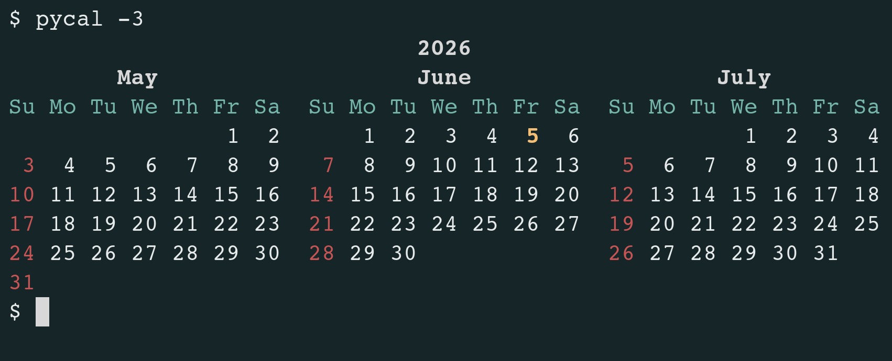
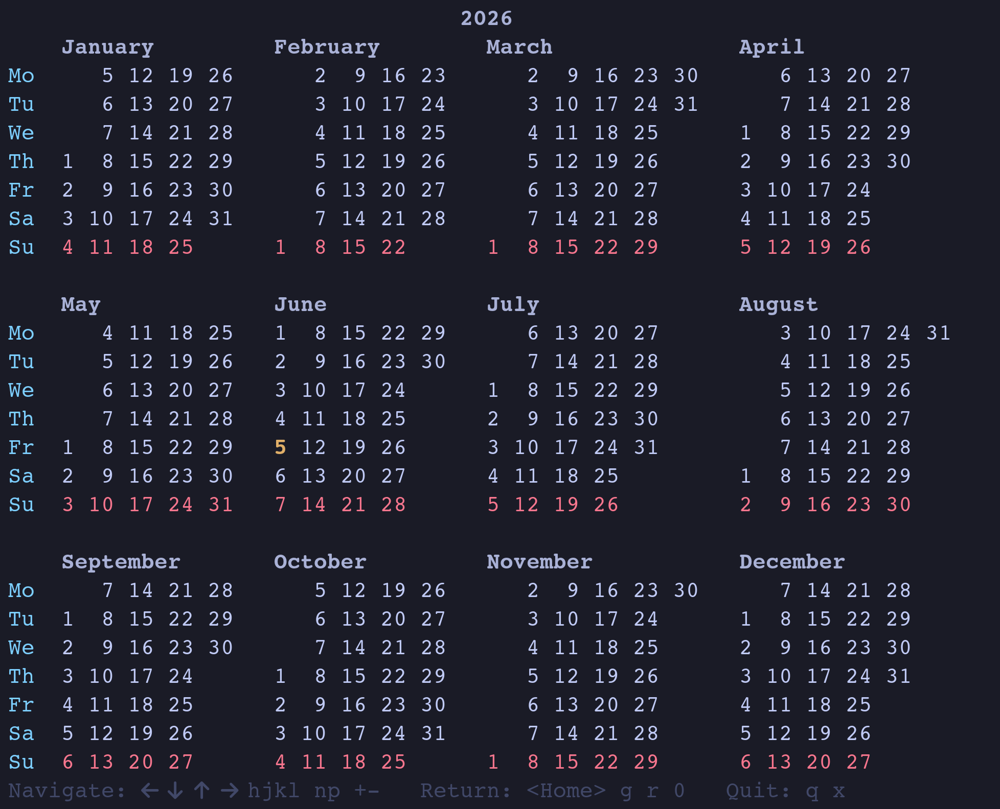

# pycal – Calendar Display Utility

_**pycal**_ is a small utility written in Python that displays calendars in a
manner not entirely unlike the legendary _**cal**_ and _**ncal**_ programs.
What makes it different is that the calendars it displays are nicely colored.



_**pycal**_ understands the following options:

```console
$ pycal -h
usage: pycal [-h] [-1] [-3] [-m] [-n] [-y] [[month] year]

positional arguments:
  month       specify month (eg, Apr, April or 4)
  year        specify year

options:
  -h, --help  show this help message and exit
  -1          show current month (the default)
  -3          show prior, current, and next month
  -m          weeks start on Monday
  -n          simulate ncal (vertical) format
  -y          show full year
```

Additionally, it comes with an interactive utility called _**ipycal**_, which displays a full
year and lets you navigate between years.



Share and enjoy.

## Authors

* **Dimitry Ishenko** - dimitry (dot) ishenko (at) (gee) mail (dot) com

## License

This project is distributed under the GNU GPL license. See the
[LICENSE.md](LICENSE.md) file for details.
